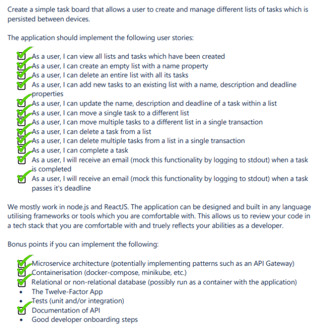
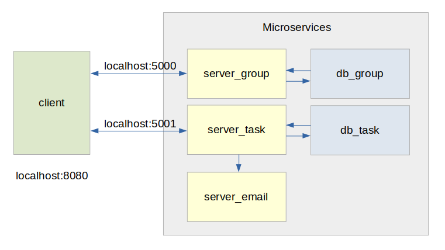

# Simple Task Manager

```
Simple task manager running on microservices architecture.

Frontend Framework  : React.js
UI Framework        : Ant Design

Backend Framework   : Express.js
Database NoSQL      : MongoDB - Mongoose.js
Scheduling          : node-schedule.js

DevOps              : Docker - Docker Compose
Architecture        : Microservices
```

## Live Demo

For your convenient, This project has been uploaded and run on my server: [https://mbwass.com:8080](https://mbwass.com:8080)

## Run Project Locally

Please make sure Docker and Docker Compose has been installed into your local machine.

```bash
git clone https://github.com/kevinnhansenn/simple-task-manager.git

cd simple-task-manager/

docker-compose up --build

# After all the containers have been running successfully.
# On your browser, Open [http://localhost:8080]
```

In case you want to rollback the data into the preassigned data
```bash
docker-compose down -v # Remove all volumes

docker-compose up 
# Once started, it will check whether it has data in the db
# If not, it will pre-assign the db with dummy data
```
## Case Study


## Application Quick Look


## Microservice Architecture


## Documentation
```
MongoDB Data Structure

    # db_group (::27017 /group):
    
        - name 
            - type: String
            - required
            
            
    # db_task (::27018 /task):
    
        - name 
            - type: String
            - required
            
            
        - description 
            - type: String
            - required
            
            
        - deadline 
            - type: String (YYYY-MM-DD)
            - required
            
            
        - group 
            - type: String
            - required
            
            
        - completed 
            - type: Boolean
            - default: false
            
            
        - expired 
            - type: Boolean
            - default: false
```
```
REST API Docs

    *Object Format:
        
        Group {
            _id,
            name,
            createdAt,
            modifiedAt
        }
        
        Task {
            _id,
            name,
            description,
            deadline,
            completed,
            expired,
            createdAt,
            modifiedAt
        }
        


    # server_group (localhost:5000):
    
        - GET /
        
            - Get list of groups from database.
            - Request: None
            - Response: Group[] (all)
            
            
        - POST /add
        
            - Add new group to database.
            - Request: { name }
            - Response: Group[] (all and updated version)
            
            
        - POST /delete
        
            - Delete group using id.
            - Request: { id }
            - Response: Group[] (all and updated version)
            
            
            
    # server_task (localhost:5001):
    
        - GET /
        
            - Get list of tasks from database.
            - Request: None
            - Response: Task[] (all)
            
            
        - POST /add
        
            - Add new group to database.
            - Request: { name, deadline, description, group }
            - Response: Task[] (all and updated version)
            
            
        - POST /complete
        
            - Completed a task by id.
            - Request: { id }
            - Response: Task[] (all and updated version)
 
 
        - POST /delete
        
            - Delete a task by id.
            - Request: { listOfId }
            - Response: Task[] (all and updated version)
            
            
        - POST /move
        
            - Move selected tasks to different group.
            - Request: { listOfId, targetGroup }
            - Response: Task[] (all and updated version)
            
            
        - POST /deleteByGroup
        
            - Delete all records based on their group.
            - Request: { id }
            - Response: Task[] (all and updated version)
            
            
    
    # server_email (localhost:5002):
            
        - POST /taskCompleted
        
            - Send a fake email (console.log) if a task has been completed.
            - Request: { task: Task }
            - Response: None
            
            
        - POST /taskExpired
        
            - Send a fake email (console.log) if a task has been expired.
            - Request: { task: Task }
            - Response: None
```

## Credit
&copy; Kevin Hansen - May 23, 2021
